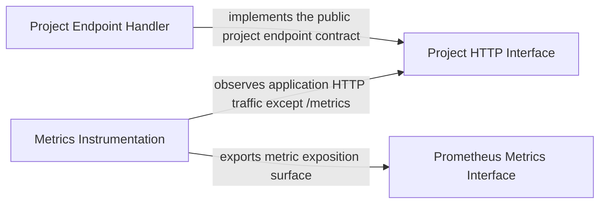

# ARCH-COMPONENT — Components

- Project: Projeto Korp DevOps Challenge
- Operational revision: 6
- Classification: `declared/proposed/inferred` pre-codebase state
- Projection: `flowchart`

## Operational summary

Purpose: Modelar e governar a arquitetura pre-codebase do desafio Korp, preservando rastreabilidade entre requisitos, criterios de aceite, decisoes, componentes e validacao.
Compiled 7 projected items from operational revision 6.
