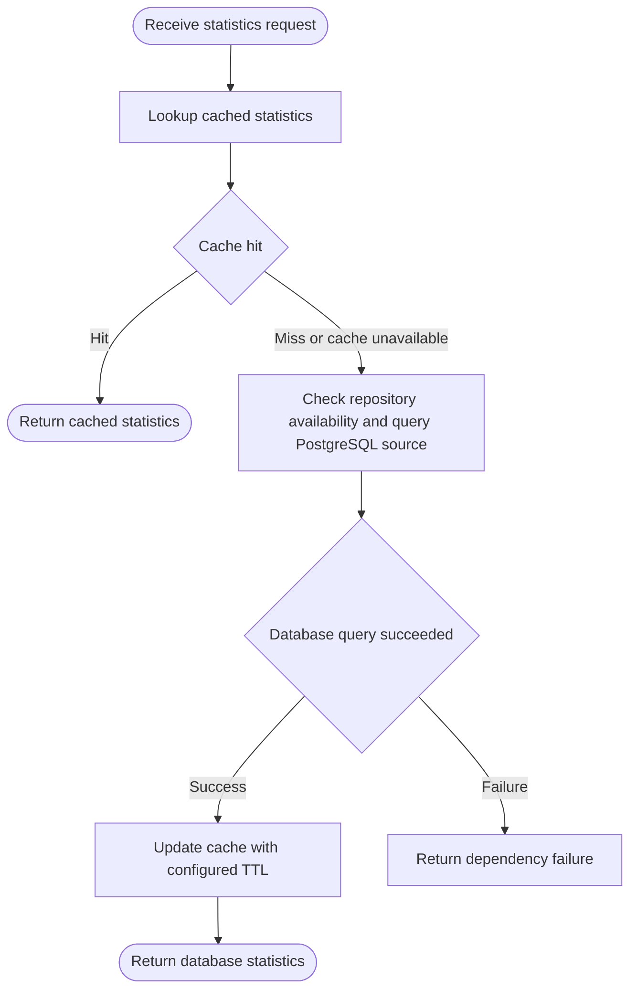

# BEH-ACTIVITY — Activity and Control Flow

- Project: Projeto Korp DevOps Challenge
- Operational revision: 7
- Classification: `declared/proposed/inferred` approved canonical as-built state
- Projection: `flowchart`

## Operational summary

Purpose: Modelar e governar a arquitetura implementada e validada do Projeto Korp, preservando rastreabilidade entre requisitos, decisoes, componentes, containers, dados, processos operacionais e o estado as-built da aplicacao.
Compiled 17 projected items from operational revision 7.
